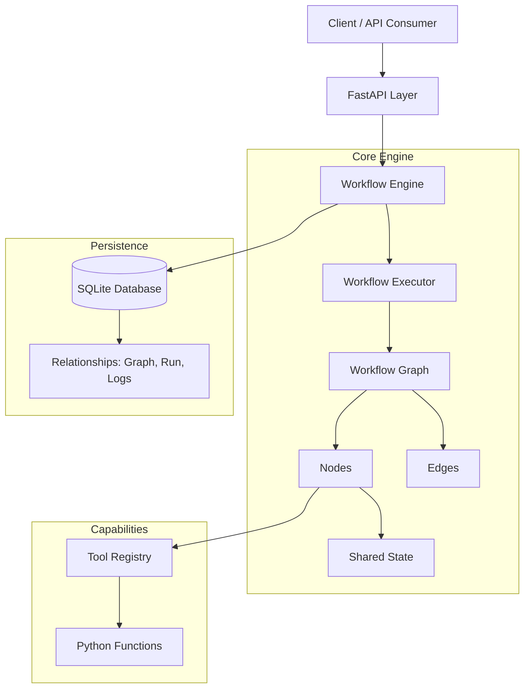

# StateFlow - Minimal Workflow Engine

A production-ready workflow engine for building agent workflows, similar to LangGraph. StateFlow allows you to define sequences of steps (nodes), connect them with edges, maintain shared state, and execute workflows with support for conditional branching and looping.

## Architecture



## Features

- **✅ Node-based Workflow**: Define steps as Python functions with automatic state management.
- **✅ Flexible Routing**: Support for simple sequential edges, conditional branching, and loops.
- **✅ Tool Registry**: Decorator-based system for easy tool management and discovery.
- **✅ RESTful API**: Full endpoints for graph creation, execution, and state retrieval.
- **✅ Real-time Streaming**: WebSocket support for live execution logs.
- **✅ Async Execution**: Background task processing for long-running workflows.
- **✅ Production Ready**: SQLite persistence, Pydantic validation, and comprehensive logging.

## Project Structure

```
StateFlow/
├── app/
│   ├── api/                 # API routes & WebSocket
│   ├── engine/              # Core workflow engine
│   ├── models/              # DB models & Pydantic schemas
│   ├── tools/               # Tool registry & definitions
│   ├── workflows/           # Sample workflow definitions
│   ├── database.py          # Database connection
│   └── main.py              # Application entry point
├── tests/                   # Test suite
└── run.py                   # Dev server runner
```

## Quick Start

### 1. Installation

```bash
git clone https://github.com/nimish1402/StateFlow.git
cd StateFlow
python -m venv venv
# Activate venv: .\venv\Scripts\activate (Windows) or source venv/bin/activate (Mac/Linux)
pip install -r requirements.txt
```

### 2. Run the Server

```bash
python run.py
```
Access the API docs at `http://localhost:8000/docs`

### 3. Run Sample Workflow

```bash
python test_api_examples.py
```

## Sample Workflow: Code Review Mini-Agent

The project includes a "Code Review Agent" that demonstrates the engine's power:
1. **Extracts Functions** from code.
2. **Checks Complexity** metrics.
3. **Detects Issues** (bugs/smells).
4. **Suggests Improvements**.
5. **Calculates Quality Score** and **loops back** if the score is too low.

## API Endpoints

- `POST /graph/create`: Define a new workflow graph.
- `POST /graph/run`: Execute a workflow (sync).
- `POST /graph/run/async`: Execute a workflow (async/background).
- `GET /graph/state/{run_id}`: Get execution status and logs.
- `WS /ws/run/{run_id}`: Stream execution logs in real-time.
- `GET /tools`: List available tools.

---

**Developed by Nimish Selot**
